<div align="center">

[](https://www.linkedin.com/in/www.linkedin.com/in/parth-vaghasiya-3181b6337/)
[](mailto:parthvaghasiya6755@gmail.com)


</div>

---

## `> SYSTEM BOOT`

```text
[ 0.001 ] kernel      : mechanical engineering fundamentals ........ loaded
[ 0.412 ] runtime     : M.Sc. Smart Energy Systems (Hochschule Ansbach)
[ 0.730 ] core        : python | sql | pandas | scikit-learn | tensorflow
[ 1.105 ] interface   : streamlit dashboards, READMEs that actually explain things
[ 1.480 ] agents      : langchain -> langgraph -> RAG on energy data .. in progress
[ 1.900 ] directive   : take a messy real-world problem, ship a working solution
[ 2.000 ] STATUS      : ONLINE. Open to Werkstudent / junior data & AI roles.
```

## `> WHO I AM`

I turn messy, real-world data into working tools. My background is **mechanical engineering**, my current field is **smart energy systems**, and my focus is **data science, ML and AI agents**. The role I'm building toward is **Forward Deployed Engineer**: sit close to a real problem, understand the domain, and ship something people actually use.

| Module | Detail |
|---|---|
| **Domain** | Energy systems, grids, renewables |
| **Core skills** | Data analysis, ML modelling, dashboards, SQL |
| **Next unlock** | LLM agents (LangGraph), RAG pipelines, evaluation |
| **Languages** | English, Hindi, German (developing) |

## `> ACTIVE MISSIONS`

| # | Mission | What it does | Stack |
|---|---|---|---|
| 01 | [**MNIST Digit Classification**](https://github.com/YOUR_USERNAME/mnist-digit-classification) | Perceptron vs. ANN vs. CNN on held-out data: **90.9% -> 97.5% -> 99.1%** | TensorFlow, Keras |
| 02 | **Stroke Risk Predictor** | Five-model comparison with a Streamlit app; fixed a train/inference column-order bug with a serialized `columns.pkl` | scikit-learn, Streamlit |
| 03 | **Ford Car Price Prediction** | R² = 0.84 on ~18,000 UK listings; compared one-hot vs. label encoding | pandas, scikit-learn |
| 04 | **Titanic Survival Classification** | SVM (RBF) best; caught a pandas `inplace fillna` bug that failed silently | pandas, scikit-learn |
| 05 | **FIFA World Cup 2026 Analysis** | Player performance analytics | pandas, Plotly |
| 06 | **Anime Analytics Dashboard** | Dark glassmorphism dashboard with interactive charts | Streamlit, Plotly |

> Link each mission to its repo: replace the plain names above with `[name](https://github.com/YOUR_USERNAME/REPO)`.

## `> TOOLKIT`

<div align="center">


</div>

Also used in energy projects: PV\*Sol, PVsyst, LabVIEW, Excel.

## `> AGENT ROADMAP`

```text
STAGE 1  LLM fundamentals ............................ [##########] done
STAGE 2  APIs + function calling (LangChain) ......... [######----] in progress
STAGE 3  Agents with LangGraph ....................... [##--------] next
STAGE 4  RAG pipelines on energy data ................ [----------] queued
STAGE 5  Hallucination + output evaluation ........... [----------] queued
```

> Edit the progress bars to match where you really are.

## `> OPERATING PRINCIPLES`

- **Start from the customer's problem**, not the model. The domain decides the approach.
- **Ship working things.** A deployed demo beats a perfect notebook.
- **Test on data the model has never seen.** (I once caught my own train/test mix-up before publishing.)
- **Document so a stranger can run it.** Every repo gets a real README.

## `> TELEMETRY`

<div align="center">


</div>


